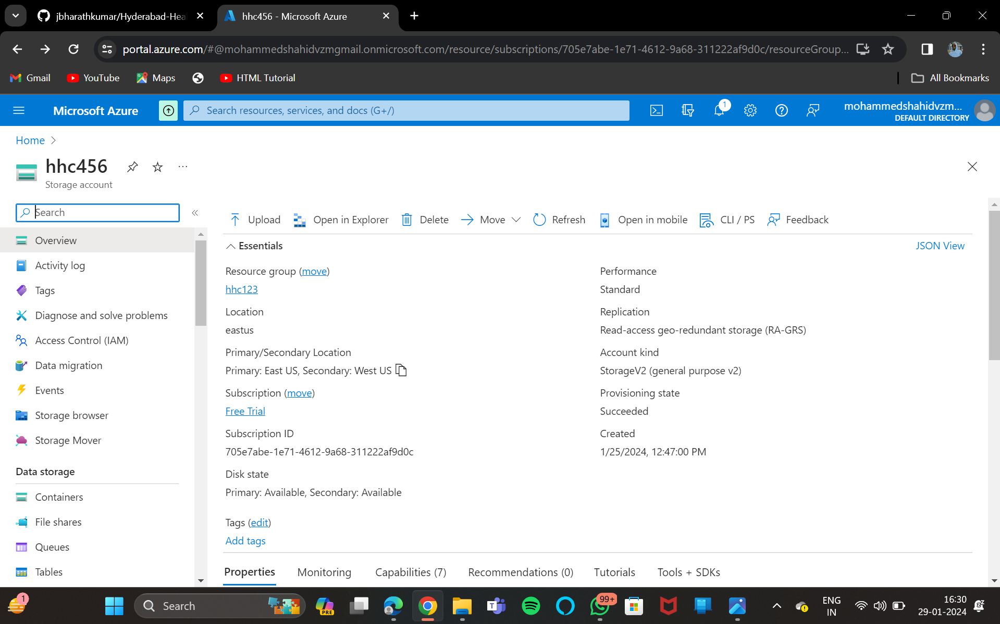
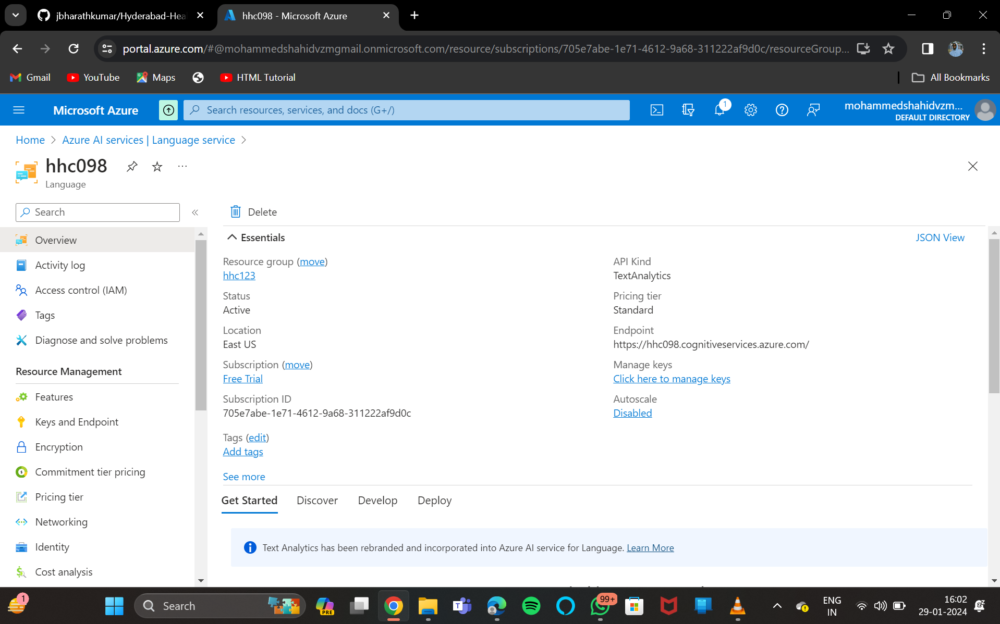
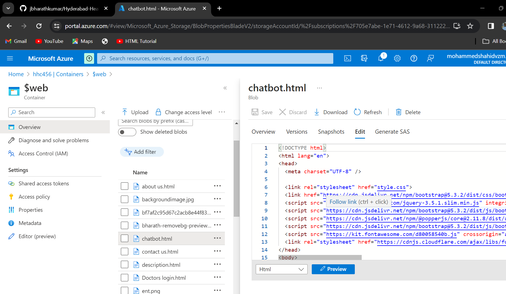

<h1>HHC - Website</h1>
<h1> "Hyderabad-Health-care" </h1>
HHC-website
"HYDERABAD HEALTH CARE"
"Patient is our health priority."

<h1> Project Details: </h1>

Project Demo URL : https://hhc456.z13.web.core.windows.net/ 
Demo Video URL : 
Github Repository URL : https://github.com/jbharathkumar/Hyderabad-Health-Center  
Industry : Hyderabad Health Center

<h1> Roles & Responsibilities: </h1>

Bharath(Project management) - Manages the web development project. 
Sai kiran(Content management) - Responsible for managing the website content. 
Kalpana(Documentation management) - Responsible for managing the Documentation process. 
Mohammed Shahid(Deployment Specialist) - Deployment and maintenance of project infrastructure.

<h1>AZURE AI SERVICES USED: </h1>
Azure Bot Service 
Manage Identity 
Azure AI Service 
Search Service 
Azure Backup 

<h1>PROBLEM STATEMENT:</h1>
"In today's fast-paced real estate market, potential homebuyers and sellers often face challenges in finding a platform that seamlessly connects them with the right opportunities. Existing real estate websites may lack user-friendly interfaces, comprehensive property information, or reliable tools for property valuation. Additionally, the overwhelming amount of data and choices can make the process confusing and time-consuming. Buyers struggle to find their ideal homes, and sellers face difficulties in showcasing their properties effectively. Both parties often grapple with uncertainties related to property values, market trends, and the overall real estate landscape. In this landscape, there is a clear need for a real estate website that addresses these pain points. An innovative platform that provides a user-friendly experience, offers comprehensive property details, utilizes advanced tools for valuation, and creates a transparent and efficient marketplace for buying and selling real estate. The challenge is to develop a real estate website that not only streamlines the property search and transaction process but also empowers users with the information and tools they need to make informed decisions in the dynamic and competitive real estate market."

<h1>PROJECT DESCRIPTION:</h1>
Explore the advanced healthcare offerings of Hyderabad Hospital's web page, designed to bring unparalleled medical services to the vibrant cities of Hyderabad, Chennai, Kolkata, Mumbai, Gurugram, and Pune. Specializing in Ophthalmology, Cardiology, ENT, and Radiology, our hospital provides a comprehensive range of top-notch services, including advanced diagnostics like X-rays, Ultrasound, and MRI. Get acquainted with our distinguished medical professionals: Dr. Bharat (Ophthalmology), Dr. Shahid (Radiology), Dr. Kalpana (ENT), and Dr. Sai Kiran (Cardiology). Leveraging cutting-edge technology, our web page offers detailed insights into our services and medical experts.

Experience the ease of managing your healthcare with our user-friendly online appointment booking system. Patients can effortlessly schedule appointments from the comfort of their homes, regardless of their location. Furthermore, our secure patient login feature allows access to personal medical histories, ensuring a personalized and convenient healthcare experience.

<h1>CORE AZURE SERVICES:</h1>
<h2>Azure Storage Services</h2>
Azure Storage Account is a cloud-based storage solution provided by Microsoft Azure, a leading cloud computing platform. It serves as a scalable and secure repository for various types of data, offering a range of storage services to meet diverse application needs.

<h1>Azure Blob Storage</h1>

Azure Blob Storage is a cloud-based object storage service in Microsoft Azure, designed for storing and managing large amounts of unstructured data, such as documents, images, and videos. It provides scalable and secure storage, supporting different access tiers based on data usage patterns. Blob Storage is commonly used for backup, data archiving, and serving content to web applications.

<h1>Azure Backup Service</h1>

Azure Backup Service is a cloud-based solution provided by Microsoft Azure that enables organizations to back up and protect their data and workloads in the cloud. It offers a reliable and scalable backup solution with features designed to safeguard critical information

<h1>Azure App Service Plan</h1>

Azure App Service Plan is a foundational component within Microsoft Azure that defines the region, compute resources, and features available to host web applications, mobile app backends, and RESTful APIs using Azure App Service.

<h1>AZURE AI SERVICES:</h1>

Azure Bot Service
Azure Bot Service is a cloud-based service provided by Microsoft Azure that enables the development, deployment, and management of intelligent bots. Bots created using Azure Bot Service can interact with users across various channels, such as web, mobile, Microsoft Teams, Skype, and more.

<h1>Manage Identity</h1>

Azure Managed Identity is a service in Microsoft Azure that enhances the security and ease of access to cloud resources by providing an identity management solution for applications and services

<h1>Azure AI Service</h1>

Azure AI services encompass a suite of artificial intelligence (AI) offerings provided by Microsoft Azure, designed to empower developers and businesses to integrate AI capabilities into their applications and workflows.

<h1>Search Service</h1>

Azure Search Service is a fully managed, cloud-based search-as-a-service solution provided by Microsoft Azure. It allows developers to integrate powerful search capabilities into their applications without the need for complex infrastructure or extensive search engine expertise.

<h1>SCREENSHOTS</h1>

<h1>Language Services</h1>

<h1>Data Protection</h1>

<h1>Bot.Html</h1>

<h1>CHATBOT</h1>

